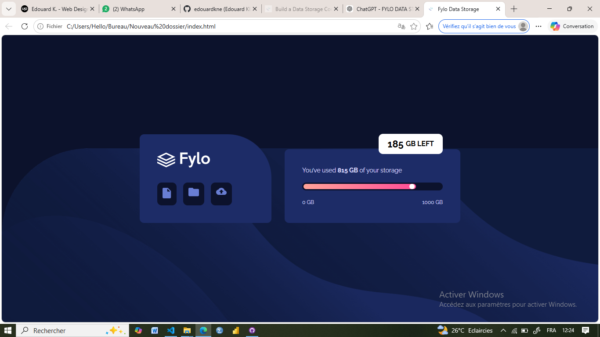

# Fylo Data Storage Component

## Table of Contents
- [Overview](#overview)
- [Project Description](#project-description)
- [Preview](#preview)
- [Features](#features)
- [Technologies](#technologies)
- [Installation](#installation)
- [Author](#author)

## Overview
The Fylo Data Storage Component is a modern, responsive UI component inspired by the Fylo landing page challenge.  
It showcases a user-friendly interface to display file storage information, recent activity, and shared files.  
This project focuses on **clean HTML5 structure, professional CSS design, and responsive layout** for desktop and mobile devices.

## Project Description
This component allows users to visualize their file storage usage and activity at a glance.  
It is designed with a **mobile-first approach** and adapts seamlessly to tablet and desktop screens.  
The component emphasizes accessibility, clean code, and smooth UI/UX interactions suitable for professional web projects.

## Preview

### Desktop View


### Mobile View


## Features
- Fully responsive layout (mobile-first)
- File storage overview with cards
- Recent activity tracking
- Hover effects for interactivity
- Accessibility-focused HTML structure
- Clean and maintainable CSS

## Technologies
- **HTML5** – semantic structure for better accessibility and SEO  
- **CSS3** – Flexbox, Grid and responsive design  
- **Google Fonts & Font Awesome** – typography and icons

## Installation
To run this project locally:

1. Clone the repository:
```bash```
git clone https://github.com/FreeDev-Group/Fylo-data-storage-component-by-douard-

2. Navigate to the project folder:
cd fylo-data-storage-component

3. Open index.html in your preferred browser.

## Author
**Edouard KIZA NDENGO** – [GitHub](https://github.com/edouardkne)

This project was inspired by the [Fylo Landing Page Challenge on Frontend Mentor](https://www.frontendmentor.io/challenges/fylo-data-storage-component-1dZPRbV5n). 
        All design and implementation were adapted and coded by me.
